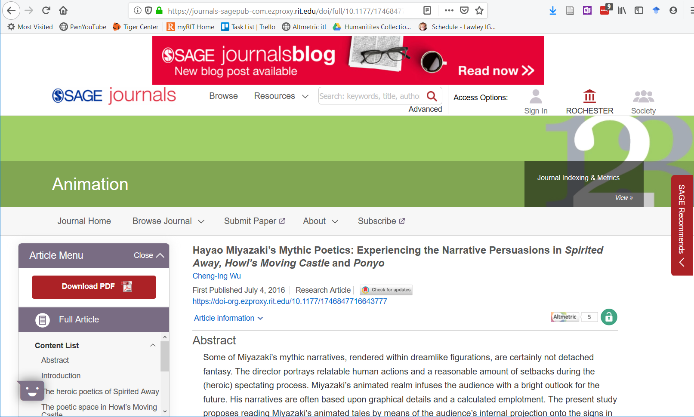
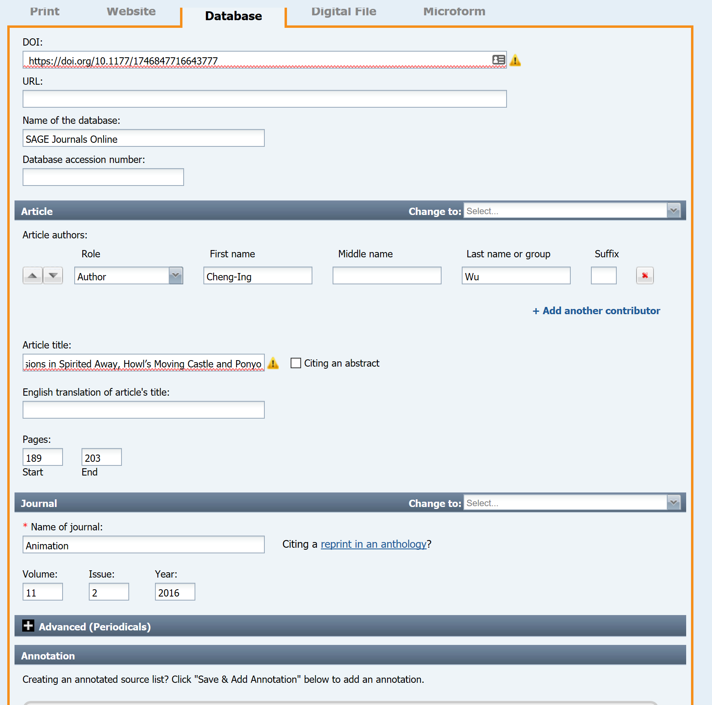
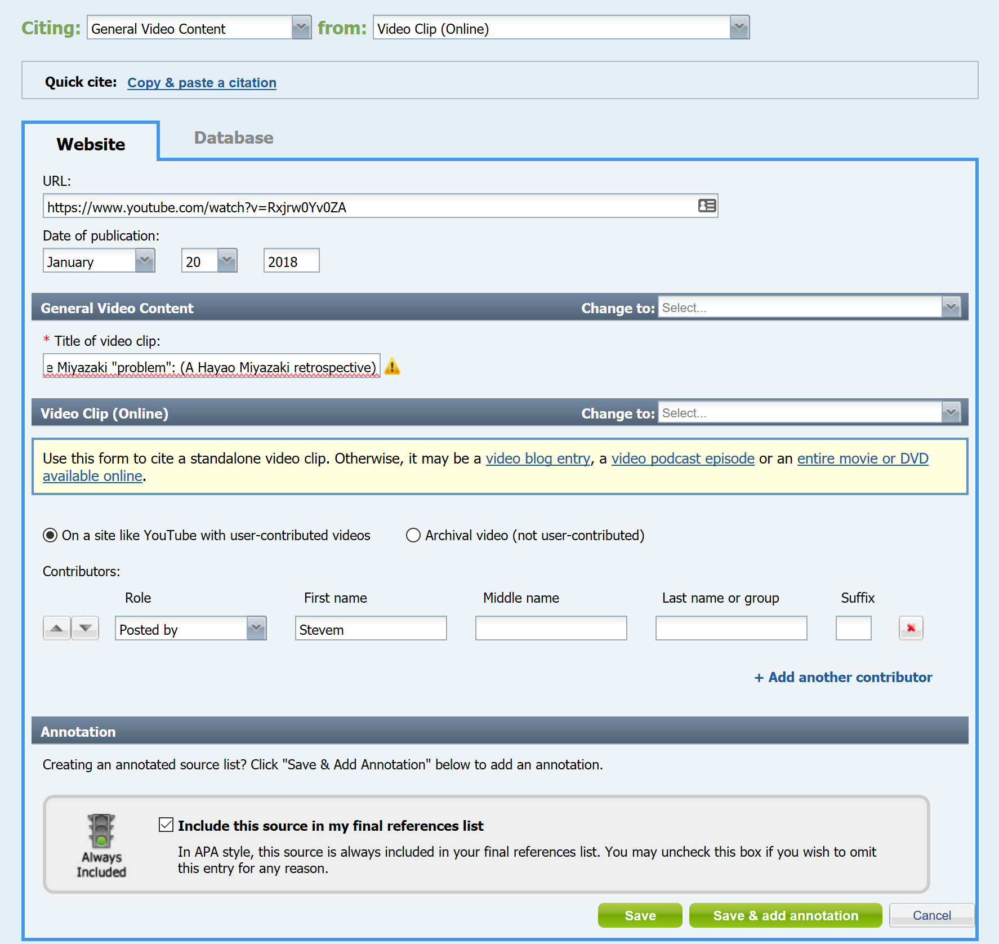
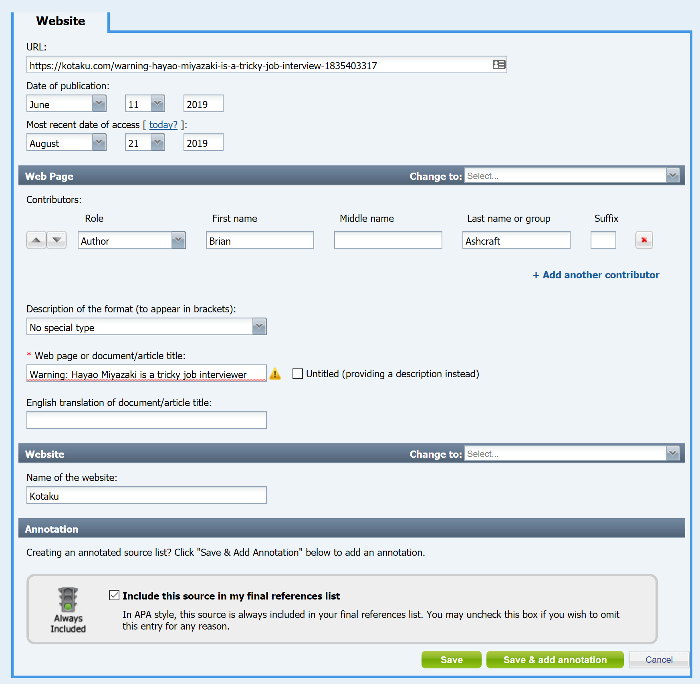
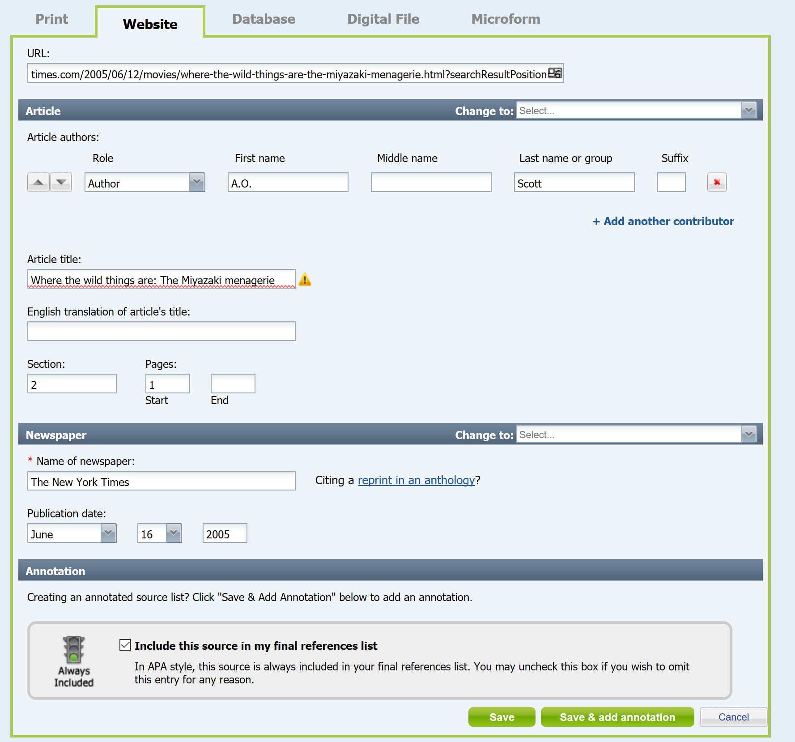
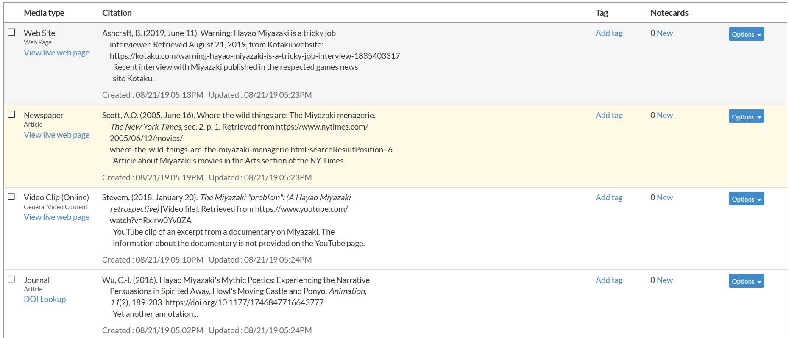
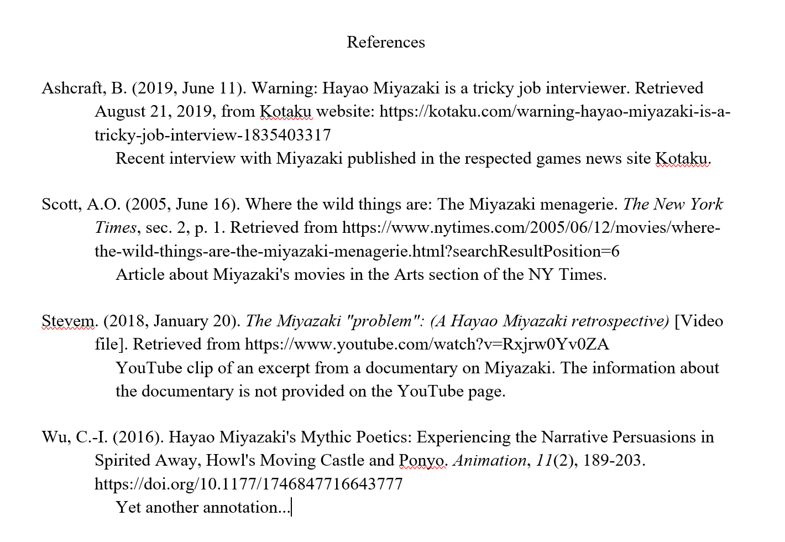

# Bibliography Exercise (Week 2, Thursday 9/6)

In today's exercise, you will use the NoodleTools resource provided by the RIT Library to create an annotated bibliography, using a topic from the list provided below. You will start this exercise in class, but will have until 8am on Monday, 9/9, to complete it.

## Instructions

Begin by choosing one of the following topics (do not use your own research paper topic):

-   Augmented Reality
-   Hayao Miyazaki
-   Instagram

Log into [NoodleTools](https://login.ezproxy.rit.edu/login?qurl=http%3a%2f%2fwww.noodletools.com%2flogin.php%3fgroup%3d1370%26code%3d1058). Create a new project (green button in top left corner), using the APA citation style, and a citation level of Advanced. You can give it whatever name you’d like. When the project loads, it will put you in the "Dashboard" area. Using the links at the very top of the page, switch to the Sources section--that's the only one you'll need for this exercise.

Using the resources discussed in class the readings from this week's readings, look for materials that might be appropriate for a paper on this topic. You should identify at least four sources that come from high-quality edited or curated sources--books, magazines, journals, academic conference proceedings, newspapers, or reputable edited websites. ([Library databases](http://infoguides.rit.edu/c.php?g=332548&p=2234486) and/or [Google Scholar](https://scholar.google.com/) are your best sources for these.) The other four can come from any source, including blogs, forum posts, marketing materials, personal websites, and even emails or social media posts.

**Note**: If you find the resource in a library database, make sure you are citing the original article, not the database entry. For example, here's an article about Hayao Miyazaki from the Sage Journals database.

To include this in your bibliography, you would choose "+New Source" and select "Database". You'll then get a number of different options. This is original content that's stored in a database, and it's from a journal (which you can tell because the navigation bar includes the word journal, and the article type is a "Research Article").

Once you've selected "Journal", you'll get a data entry screen for the article. At the top, you put in information about where you found the article. Below that, you'll put the information about the article itself.

After you save the entry, add a brief (1-2 sentence) annotation describing the article.

Here are examples of a few other types of references you might include:

-   **Youtube Video**
    

-   **Kotaku Article**
    

-   **New Youk Times Article**
    

Repeat this process for all eight of your sources, making sure that you include all relevant information (author, even if it's an organizational author, publication date, URL, etc). For each source, you should also include a 1-2 sentence annotation of what the source includes and why you included it. (e.g. "This article provides a detailed discography of works by the artist, and was published by a well-respected industry website."

When you're done, your sources list should look something like this:

When you have eight references, with at least four of those being from edited or curated sources, use the "Print/Export" button at the top of the citation list to export it as a Word document (.docx or .doc). You'll end up with something like this (I've modified the formatting in my document to make the line and paragraph spacing a bit nicer...):

## Deliverables

Upload your completed bibliography to the myCourses Dropbox.
