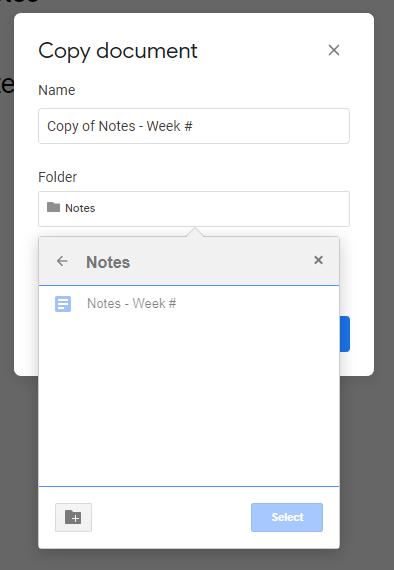

# Week 1 Thursday Exercise: Google Drive and Discord Collaboration

1.  Log into RIT's Google Apps site (<http://google.rit.edu>), go to the Drive section, and select the "Shared drives" option in the left sidebar. You should see a folder for your group (e.g. "IGME.110.2019 Group X"). If you don't see it, let the Professor know that there's a problem.

2.  Have one memeber of your group create a new folder named "Weekly Notes". (+ New->Folder)

3.  Have another memeber(or same) open the Google Document [Notes - Week #](https://drive.google.com/open?id=1bliPxbg24g7vYnL36EveP9gx89ukAj6kT9Lb-G1Qujk). This will be the template you will use for the notes you will take each week for this class.

4.  Now make a copy (File->Make a copy) of this file. In the popup that opens change the name to "Notes - Week 1, and the folder to the one you created in the previous step.
    _You will repeate this step for each of the weeks of class (1-15), but you do not have to do this now._

5.  Everyone now open the "Notes - Week 1" document, and add some notes from this week's lectures. If other members of your group have already entered notes, you don't need to replicate them--instead, you can add to them, edit them, format them, etc. There doesn't need to be a lot of content, but when we look at the version history for the file (File->Version History->See version history), we should see some evidence of meaningful partcipation by you.

6.  In a different browser tab, open the class Discord. (_You can also do this from the desktop/mobile app_)

7.  Find your group's private channel; it should show up in the channel list on the left side. If you don't see a private channel with your group's number, it's because we couldn't find you on Discord when they were set up; ask the Professor to add you now.

8.  Configure your Discord notifications. ([How do I mute and disable notifications for specific channels?](https://support.discordapp.com/hc/en-us/articles/209791877-How-do-I-mute-and-disable-notifications-for-specific-channels-)) You can change the overall settings for the Discord, and then you can override the global settings on a channel-by-channel basis. What I generally do is turn on all notifications for the class, and then mute individual channels, like #github-updates or #memes-n-stuff. You're welcome to set it up in whatever way works best for you. (However, since the #announcements channel is used only by the professor and TA for class-wide announcements, it's probably a bad idea to mute that channel!)

**_If you have an iOS or Android mobile device, I highly recommend installing the Discord app so that you don't have to be in front of a computer to get notifications!_**
