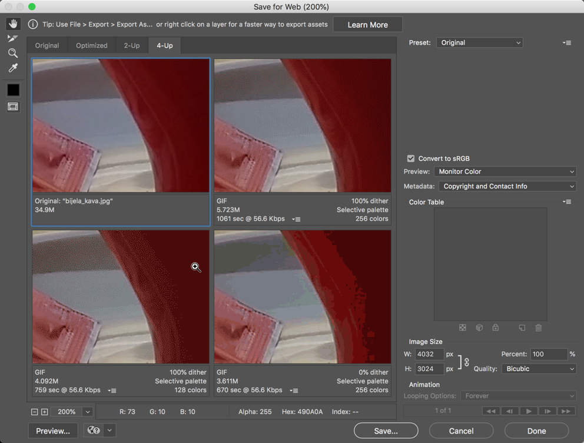

# Image Basics: Color, Compression, and File Optimization

For today’s exercise, you’ll be using Photoshop to experiment with the effects of different color models and compression methods on image files.

Before you begin, you'll need to download and extract the image files in imageOpt.zip.

## Part 1: Color Models

1.  From the archive you just downloaded, open the file Sunflower150.jpg in Photoshop.
2.  Display the Channels Window (Window > Channels)
3.  View the Image > Mode menu. The current color mode of the image (RGB, PhotoShop’s default) has a check mark next to it in the mode menu. What menu items are grayed out? (Make a note of this.)
4.  Switch the mode to CMYK. (If you get a warning, click Yes to proceed.) Note the changes in the Channels window.
    View the Mode menu again. How have the options changed?
5.  Switch the mode to Grayscale (if prompted, agree to discarding color changes). What happens to the Channels window now? Look at the mode menu: what’s different?
6.  You now have access to the Bitmap option in the Mode menu. This refers to the strictest definition of a bitmap, or a 1-
    bit color image, where each pixel in the image is mapped to one bit of information; on or off, white or black.
7.  Change the mode to Bitmap. Set the output resolution to 96ppi and the diffusion method to Diffusion Dither. Try zooming in, so you can see the individual pixels.
8.  After viewing the results, select History from the Window menu. You will see a list of your modifications to the image. Return to the original ("Open") version. The changes you made are all still listed, and you can go back to any of them.
9.  In the bottom left corner of the window, next to the zoom percentage, you should see "Doc:2.41M/2.41M". The number on the left represents the printing size of the image--approximately the size of the saved, flattened file in Adobe Photoshop format. The number on the right indicates the file’s approximate size including layers and channels.
10. Step forward through the history to look at the CMYK and then the Grayscale versions; how does the document size change for each of these?
11. Close this file. (You don’t need to save any changes.) We’re done with it.

## Part 2: Color Depth and Palettes

In the previous section we changed color modes, which indirectly changed the color palettes available (as you should remember from lecture, CMYK and RGB have overlapping but different palettes of colors, while grayscale and bitmap use only variations on black and white).

In this part of the exercise, you’ll be working more directly with palettes, particularly in Indexed Color mode, which restricts you to 256 or fewer colors in the palette (unlike RGB and CMYK, which have millions of available colors in their palettes).

1.  Open the image cartoon.psd.
2.  Zoom in to at least 400%, and make sure you can see the blade of the axe.
3.  From the Image > Mode menu, select Indexed Color.
4.  In the dialog box, try the following, noting the changes in the image (in particular, observe any changes to the gradients in the hammer):
    -   Change the Dither from Diffusion to Pattern to None.
    -   Change Color Depth to 32 colors. What happens to the axe blade?
    -   Change the Dither back to Diffusion. What happens now? (Try zooming in so you can see the pixels more clearly.)
    -   Change the palette to the Web Palette rather than Local. How many colors is it using now? Did that improve or reduce the quality of the image?
    -   Try the Mac and Windows OS palettes, and observe the number of colors and impact on quality.
5.  Return to the Web palette, and experiment with the diffusion settings to get the best version of the image you can.
6.  Save the indexed color as a GIF called webcartoon.gif (the GIF format is called Compuserve GIF in the Save As menu, because of a patent on the format).

Close the original webcartoon.psd file.

## Part 3: Compression and File Types

The three file types you'll be working with the most in interactive media are GIF, JPEG and PNG. This was covered in the readings for this week, but you can also read through the [“Image File Formats” Wikipedia article](https://en.wikipedia.org/wiki/Image_file_formats) for a review of how they differ.

1.  Open the bijela_kava.jpg file. (This is an unmodified photo taken with a Moto G5 phone.
2.  Select File->Export->Save for Web (Legacy), and choose “4-Up” on the tab at the top.
3.  Change the zoom level to 200%, and drag any of the images so that you can see the side of the cup (dragging one will affect all of them). Your screen should look something like this:

4.  If the image in the top left corner isn't set to "Original", select it and choose "Original" from the presets menu in the top right corner of the panel.
5.  For the other three versions of the image, experiment with GIF, JPEG, and PNG settings. Pay particular attention to the effect each setting has on the side of the coffee cup. Also trying zooming out to see the effect on the color quality of the image as a whole. Which version gives you the best approximation of the original image? Save that one as bijela-quality (using whatever the appropriate file extension is).
6.  In the Windows file explorer, check the size of the file that you just created. Is it larger or smaller than the original JPG file?
7.  In the bottom right corner of the panel, change the image size to 50%. Try to find the option that gives you the best tradeoff between size and quality. Save that as bijela-optimized (using the appropriate file extension).

Close the original bijela-kava.jpg file.

## Part 4: GIF Compression

To better understand how GIF compression works, we're going to work with the file Stripes.psd. Open that now.

1.  Change the Mode to Indexed Color, and use the default settings that are offered.
2.  From the Image > Mode menu, select "Color Table..." to see the colors being used in the image.
3.  Use File > Save As... and save the file as stripes1.gif. (If prompted, choose Normal rather than Interlaced.)
4.  Choose Image > Image Rotation > 90° CW. You should have horizontal rather than vertical stripes now. Save it as a GIF called stripes2.gif.

**Without looking at the files on your computer**, can you predict which file (stripes1 or stripes2) is larger, based on our discussions about run length encoding and lossless compression in the lecture? Check to see if you were right!

## Deliverables

Upload your webcartoon.gif, bijela-quality, bijela-optimized, stripes1.gif and stripes2.gif files to the Dropbox in myCourses.
