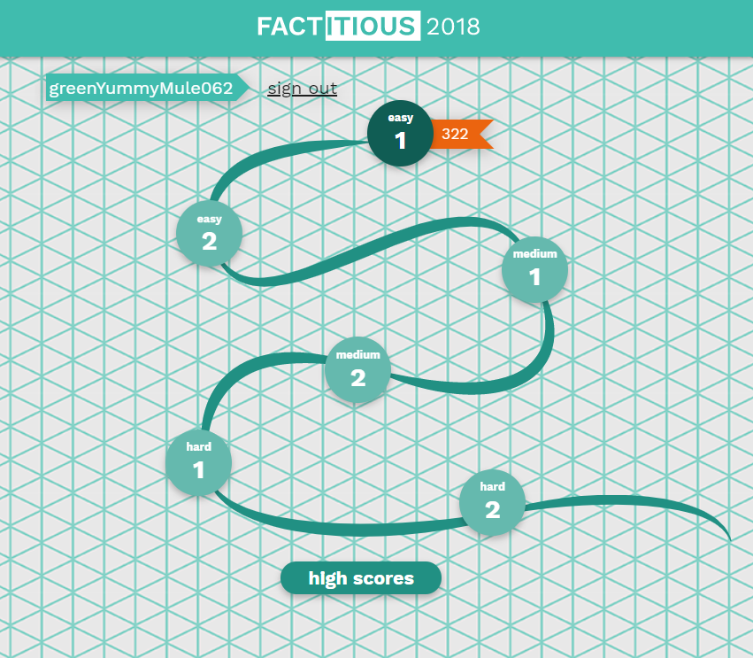

# Information Evaluation Exercise

This exercise will see how good you are at determining if a news article is real or fake.

1.  Go to the site [Factitious 2018](http://factitious.augamestudio.com/#/)

2.  Log in with your RIT Email (e.g. abc1234@rit.edu). You will need to select a randomly generated username for that email.

3.  Now play each of the 6 stages (easy 1, easy 2, etc.)

4.  Each stage has multiple rounds to it. You must complete each round.

5.  Once you have completed all 6 stages take a screenshot of you browser (Windows Alt+PrtSc) and save that to an image file.

6.  Post that image in the `info-eval` channel on our section's discord server.
