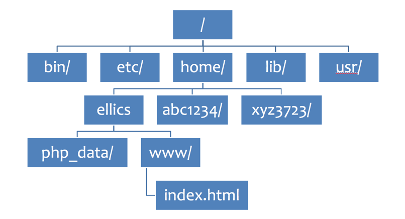

# UNIX Exercise

This exercise is intended to give you a basic level of familiarity with the UNIX environment. It is adapted from [a tutorial from UC Berkeley](https://people.ischool.berkeley.edu/~kevin/unix-tutorial/section1.html).


## Part 1: Introduction

Before moving on to using UNIX, let's briefly discuss what it is. A computer uses a set of programs, generally called the operating system, to manage its hardware resources (memory, disks, displays, input devices, etc.) on behalf of the user. UNIX is an example of such a system. It was originally developed as a research project at AT&T Bell Labs in 1969. Over the years, many versions of UNIX and UNIX-like operating systems (including Linux and Mac OS X) have been developed.

You will interact with UNIX through a special program called the shell. The shell prompts you for commands and hands these off to the operating system to be executed after you have typed them in. Commands are composed of two parts: the name of the command itself and arguments. Certain arguments, called options (usually introduced by the "-" character), alter the behavior of the command in a particular way while other arguments specify the entities upon which the command operates (e.g., names of files, computers, users). In the following example:

`$ ls -l myfile`

`ls` is the name of the command and `-l` and `myfile` are arguments. `-l` is an option which modifies the behavior of the `ls` command, and `myfile` is an argument that narrows the focus of the command. Not all commands require options or arguments; many have intelligent defaults when none are specified.

The UNIX shell comes in two major flavors: the Bourne shell, sh , and the C shell, csh. Other popular shells are derived from these (e.g., ksh, bash, tcsh). Each shell uses a particular character (or string of characters) to prompt the user for commands; not surprisingly, this is known as a shell prompt. Exercises in this tutorial show the default shell prompt for bash, the "$" character. In most cases, they will work equally well with most other shells.


## Part 2: Logging In and Logging Out

Since UNIX supports multiple users at one time, you must identify yourself to the system before you can begin using it. This process is called logging in. When you connect to a computer running UNIX (often called a UNIX host), you are asked to provide two pieces of information in order to log in: your username (also called a login name), which is your identity on the system, and your password, which proves (or at least improves the likelihood) that you are indeed who you say you are.

Launch MobaXterm (on Windows) or Terminal (on a Mac), and connect to the banjo.rit.edu host with your RIT user ID and password. Of course, you'll need to substitute your actual username and the hostname of the computer you want to connect to in place of "abc1234".

```
$ ssh abc1234@banjo.rit.edu
abc1234@banjo.rit.edu's password: <your_password_here>

Last login: Thu May 18 11:57:55 2017 from [some host name]

RIT information technology resources are for the use of the RIT community only. 
By using RIT information technology resources you acknowledge that you have read 
and comply with RIT's Code of Conduct for Computer and Network Use and RIT's 
Information Security Policy and Standards. Use of RIT information technology 
resources may be monitored and unauthorized use is strictly prohibited.

$
```

When you log in, the system will print several lines of information on the screen. After you've logged in a few times and the novelty has worn off, you may be tempted to ignore this. Don't! There are a couple of important pieces of information displayed here.

The first line you see after typing your password tells you when you last logged in. If you see something like: 
`Last login: Fri Feb 14 03:52:12 from evil.hackers-r-us.org`
and you've never heard of a machine called "evil," you might begin to suspect that your account has been compromised...

The next several lines are a standard message that RIT displays to all logged in users. After this, you will see the shell prompt ("$" in our example). You are now ready to begin issuing commands to the UNIX system!

In order to ease ourselves into this business, let's begin with a very simple command, `whoami`. This command requires no options or arguments, and has the highly desirable side effect of reassuring the user by confirming his or her identity.

Enter the `whoami` command at the shell prompt and see what happens.

```
$whoami
abc1234
```

That's it — all this command does is print the login name of the current user. Congratulations, you've just had your first taste of the power of UNIX!

Now that you've learned the basics of entering commands, end your UNIX session by logging out, using the cleverly-named logout command.

Enter the logout command at the shell prompt.


```
$logout
Connection closed by foreign host.
```

Of course, you'll have to log back in to continue with the tutorial!


## Part 3: Looking Around

Like other operating systems, UNIX organizes user data, programs, etc. into structures called files. Files, in turn, are placed in directories (often referred to as "folders"). Directories are organized into a hierarchical structure, something like an upside down tree. This entire structure, including all of the directories and files, as well as the special structures the operating system uses to keep track of them, is called a filesystem. A simplified version of the banjo filesystem is shown below:



At the top of the hierarchy is a special directory, called the root directory (following the upside down tree analogy — try standing on your head if this is not clear!). This directory is represented by the "/" character. Under the root directory, you will find a number of other directories (e.g., "bin" or "etc" in Figure 3.1). Under each of these, you might find more directories, and so on. Within these directories, you will find files containing such things as programs (like the web server software), system configuration information, or user data (like my index.html file).

As you use UNIX, the shell keeps track of your current location within the filesystem. This is called the working directory. The pwd ("print working directory") command tells you where you are in the filesystem by printing the current working directory. Let's give it a try.

```
$ pwd
/home/abc1234
```
When you log in, UNIX initially sets your working directory to your home directory. This is a special location where you store your personal data as well as the configuration files that govern your account. Since you've just logged in and haven't yet learned how to change directories, what you see when you enter the pwd command is your home directory.

The location of a file or directory within the filesystem is called a pathname, because it describes the path you must follow to find it. You can construct a pathname by starting at the root directory and working your way down. Each level in the hierarchy is separated by the "/" character. If you refer back to the file structure diagram above, you'll see that there is a directory called home underneath the root directory, and underneath that is another directory called abc1234. The absolute pathname to that user's home directory would be /home/abc1234 (the first "/" character represents the root directory; the second separates "home" from "abc1234"). This type of pathname is called an absolute pathname because it starts from a fixed reference point, the root directory ("/"). A relative pathname, on the other hand, describes the location of a file in relation to the current working directory. If the current working directory were /home, the relative pathname for accessing the abc1234 directory would simply be abc1234.

To change the current working directory, use the `cd` command followed by the pathname of the desired directory.

Use the `cd` command to move to the directory just above your home directory.

```
$ cd /home
$ pwd
/home
```

Note that `cd` does not give you any feedback if it succeeds. You can use pwd to verify the new working directory. Now try `cd` without any arguments. Where does it take you?

```
$ cd
$ pwd
/home/abc1234
```
In the examples above, you used an absolute pathname ("/home") to move to the directory above your home directory. You could also have used a relative pathname. The directory above the current working directory, known as the parent directory, is identified by a special notation: ".." (two period characters).

Use the `cd` command to move up one level in the directory tree.
```
$ cd ..
$ pwd
/home
```

Now use a relative pathname to return to your home directory.

```
$ cd abc1234
$ pwd
/home/abc1234
```

Now that you know where your home directory is, let's look at the files and directories stored in it. You list files and directories with the `ls` command.

Make sure you're in your home directory (/home/abc1234), and then enter the `ls` command at the shell prompt. You should see something like this:

```
$ ls
```

Notice that the list printed by `ls` does not show any distinction between files and directories. To get a more useful listing, enter the command again, adding the "-F" option.

```
$ ls -F
php_data/     www/
```

The "-F" option causes ls to produce a "fancy" listing. A special character, appended to the filename, is used to identify certain types of files. Regular files remain unadorned.

The `ls` command is a bit reticent; it won't actually tell you about all your files unless you explicitly ask it to do so via the "-a" option.

Enter the `ls` command with the "-a" and "-F" options.

```
$ ls -aF
./  ../  .cshrc*  .history  php_data/  setup.sh*  www/ 
```

Several new files showed up this time. "./" represents the current directory and "../" represents the parent directory. The other files beginning with "." are hidden files--in this case, configuration files that control the behavior of various programs.

You can get more information about files you are listing by using the "-l" option with ls.

```
$ ls -alF
drwxr-xr-x  4 abc1234 student   98 Sep 27  2016 ./
drwxr-xr-x 71 root    root       0 Aug 25 21:09 ../
-rw-r-xr-x  1 abc1234 student 2188 May 20  2016 .cshrc*
-rw-------  1 abc1234 student 2681 Aug 29  2017 .history
drwx------  3 abc1234 student   61 May 20  2016 php_data/
-rwxr-xr-x  1 abc1234 student  481 May 20  2016 setup.sh*
drwxr-xr-x 10 abc1234 student 4096 Dec  7  2017 www/
```

The long listing generated by adding the "-l" option to the command produces information in seven columns. Here's how to decode that information, using the last line as our example:

*`drwxr-xr-x`: The first letter indicates whether the item is a directory (d) or a file (-). The next nine letters show the permissions for the file.
*`10`: Number of links to the file (not relevant for our purposes).
*`abc1234`: The username of the file's owner (in this cae, you)
*`student`: The user group of the file's owner--student, faculty, or staff.
*`Dec 7 2017`: The last modification date for the file
*`4096`: The size of the file (in bytes)
*`www/`: The file name