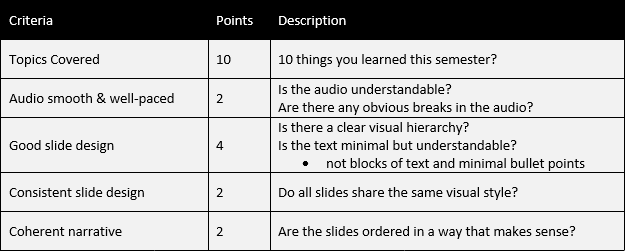

# Final Presentation

This assignment is intended to provide some closure and perspective on the overall content for this course. I believe this is more effective in helping you review and understand the material for the course than a traditional final exam.

You must build a 20-slide presentation, incorporating content from the entire semester, using the Ignite presentation format (described below and in class). You must pick 10 topics that we covered in class and explain what your learned from it. The remaining slides can be used however you’d like; options include introductory or closing material, additional slides to illustrate a concept, or your thoughts on the course as a whole. In addition to submitting the slide deck, you will need to either present it to me and the class during finals week, or add a recorded version of your narration to the presentation that you submit.

## The Ignite Format
The highly-constrained Ignite format (20 slides, each displayed for only 15 seconds) forces presenters to focus their message and practice their delivery. It also lends itself best to clear and effective visuals rather than dense slides filled with bulleted text.

## The Ignite Template
I have provided [a PowerPoint template for your presentation](https://baker-igm.github.io/IGME-110/projects/IgniteTemplate.pptx), click on the link and save the template. In the template, there is an animation at the bottom of each content slide that takes 15 seconds to display; it’s there to provide you with a visual cue on how much time you have to narrate each slide. Please do not remove that from your slides; it’s helpful to me (and to you) in ensuring that your presentation is timed properly. There are 21 slides in the template; the first one is simply the title slide, which will not auto-advance–this allows easier transition between presenters during the live presentations. The following 20 slides will each auto-advance after displaying for 15 seconds each. You’re welcome to change the design and layout of the slides, but be aware that if you try to convert the template for use in another program (OpenOffice, Google Slides, Keynote, etc), it is likely to create problems with the slide timings and/or the embedded animations, and I will not be able to provide any assistance to you on solving problems in those formats. If you want to use Google Slides you can follow the directions [here](https://pointerclicker.com/how-to-make-slides-transition-automatically-in-google-slides#tab-con-2) to get a link you can use.

## What Goes Into Your Slides?
Your slides should focus on images and storytelling, not blocks of text or bullet points. Provide a title and show an image (or animation, or video clip) relevant for the concept you can include text, but it should be minimal—any explanatory text should go either in the notes for the slide, or in your narration.

## Submitting and Presenting Your Presentation
You will not be presenting in person, you must either (a) attach your narration to the slides in PowerPoint so that it plays while the slides auto-advance, or (b) create a video incorporating the slides and your narration (upload to YouTube). The auto-advance timings must work properly, and the sound must be clear and properly synchronized. (That’s harder than it sounds, and I strongly suggest asking someone else to test it for you on their computer so that you’re sure it will work on mine.)

You must submit your presentation at least 24 hours before our final exam time. Upload, to the dropbox on MyCourses, either a PowerPoint presentation or a text file with the YouTube link for the video of your presentation. 

We will watch all submitted presentations and videos during the finals period.  

## Grading Rubric

